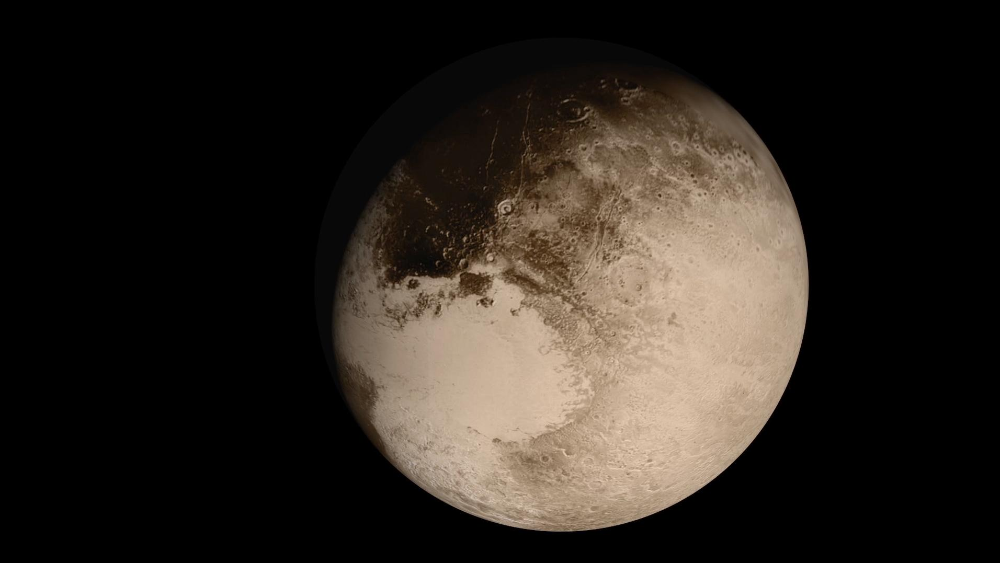

## Flying Past Pluto Animation

This dramatic view of the Pluto system is as NASA's New Horizons spacecraft saw it in July 2015. The animation, made with real images taken by New Horizons, begins with Pluto flying in for its close-up on July 14; we then pass behind Pluto and see the atmosphere glow in sunlight before the sun passes behind Pluto's largest moon, Charon. The movie ends with New Horizons' departure, looking back on each body as thin crescents.

[Source](https://images.nasa.gov/details/PIA19873)
