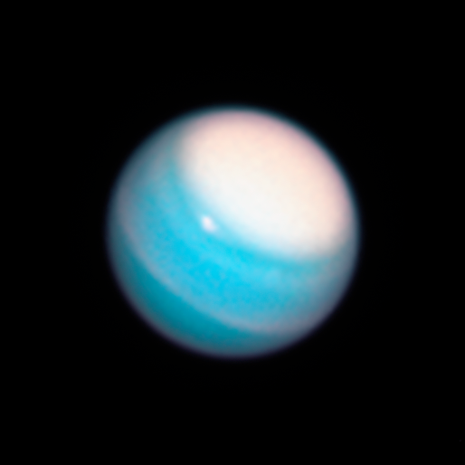

## Hubble Reveals Dynamic Atmospheres of Uranus, Neptune

This Hubble Space Telescope Wide Field Camera 3 image of Uranus, taken in November 2018, reveals a vast, bright stormy cloud cap across the planet's north pole.

Credits: NASA, ESA, A. Simon (NASA Goddard Space Flight Center), and M.H. Wong and A. Hsu (University of California, Berkeley)

[Source](https://images.nasa.gov/details/stsci-h-p1906c-f-514x514.a)
